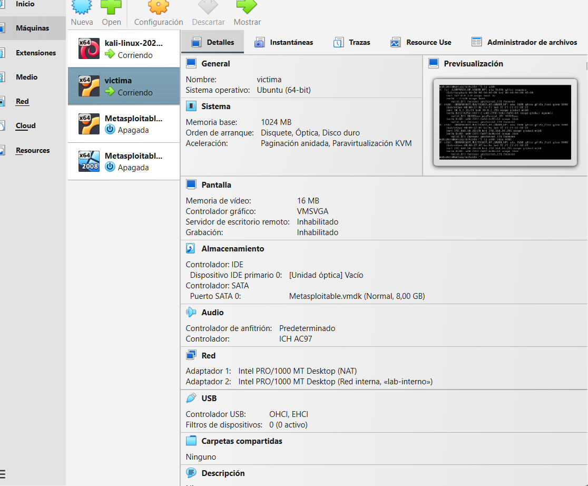
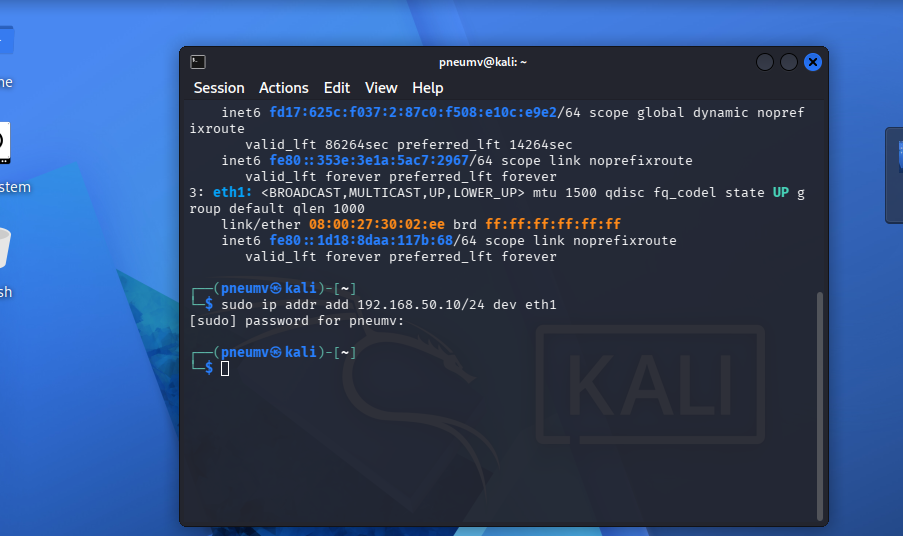
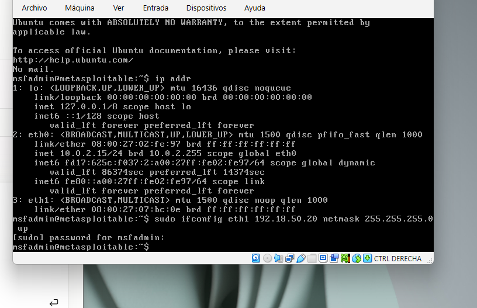
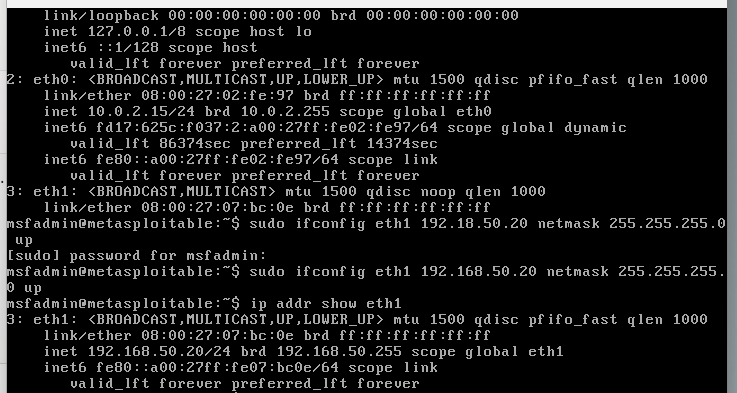
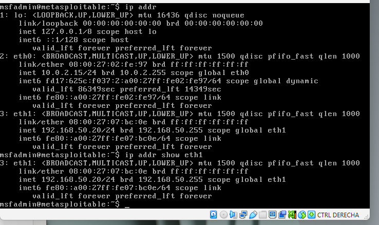
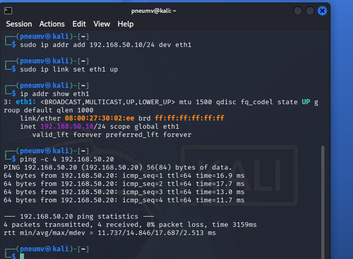

# Informe Técnico — Laboratorio 01: Setup del Entorno de Pentesting

**Fecha de ejecución:** 25-26 de agosto, 2026
**Autor:** Román Suárez
**Entorno:** Kali Linux (atacante) / Metasploitable 2 "victima" (objetivo) — VirtualBox

## 1. Objetivo

Establecer un entorno de laboratorio funcional, aislado y reproducible para la ejecución
de pruebas de penetración, compuesto por una máquina atacante (Kali Linux) con acceso a
internet para actualización de herramientas, y un canal de red privado hacia la máquina
objetivo (Metasploitable 2), sin exponer el objetivo a internet.

## 2. Alcance

- **Activo objetivo:** Metasploitable 2 (VM "victima"), Ubuntu 8.04 / kernel 2.6.24
- **Máquina atacante:** Kali Linux 2026.2, VirtualBox
- **Red:** Doble adaptador — NAT simple (internet) + Red Interna "lab-interno" (segmento privado 192.168.50.0/24)
- **Herramientas utilizadas:** VirtualBox, Nessus Essentials, `ip`, `ifconfig`, `arping`

## 3. Metodología

Ejecutado bajo enfoque **PTES**, fase de **Pre-engagement** (preparación de infraestructura
de pruebas), previo a cualquier actividad de reconocimiento o explotación.

## 4. Procedimiento y comandos ejecutados

### 4.1 Diagnóstico inicial de conectividad

Al intentar activar Nessus Essentials, la validación del código de activación fallaba de
forma reiterada. Se sospechó falta de salida a internet en Kali:

```bash
ping -c 4 8.8.8.8
# Resultado: ping: connect: Network is unreachable
ping -c 4 google.com
# Resultado: Temporary failure in name resolution
```

### 4.2 Aislamiento de causa raíz

```bash
ip addr        # eth0 en estado UP pero sin IPv4 asignada, solo IPv6 link-local
ip route       # sin ruta default configurada
```

Se descartaron progresivamente: antivirus de terceros (Kaspersky, desinstalado sin
efecto), y el propio Kali (`NetworkManager` pedía IP correctamente vía `nmcli`, pero el
DHCP nunca respondía — error `IP configuration could not be reserved (no available
address, timeout, etc.)`).

**Hallazgo raíz:** el motor "NAT Network" (`NatNetwork`) de VirtualBox no entregaba IP
pese a estar correctamente configurado (DHCP habilitado, rango `10.0.2.0/24`
verificado). Cambiar el adaptador a modo **"NAT" simple** resolvió la conectividad a
internet de forma inmediata.

```bash
ip addr
# eth0: inet 10.0.2.15/24 — asignado correctamente
ping -c 4 8.8.8.8
# 4 packets transmitted, 4 received, 0% packet loss
```

### 4.3 Activación de Nessus Essentials

Con conectividad restaurada, se completó el registro en Nessus Essentials mediante
código de activación obtenido previamente por correo, confirmando la inicialización y
descarga de plugins.

### 4.4 Construcción de topología de doble adaptador

Dado que "NAT" simple aísla cada VM en su propio segmento, se configuró un segundo
adaptador de tipo **Red Interna** en ambas VMs para permitir comunicación directa
Kali ↔ Metasploitable sin exponer el objetivo a internet:

- Kali — Adaptador 1: NAT (internet) / Adaptador 2: Red interna `lab-interno`
- Metasploitable — Adaptador 1: NAT / Adaptador 2: Red interna `lab-interno`




```bash
# En Kali (asignación manual, no persistente)
sudo ip addr add 192.168.50.10/24 dev eth1
sudo ip link set eth1 up
```



Durante la asignación de IP en Metasploitable se cometió un error de tipeo inicial
(`192.18.50.20` en vez de `192.168.50.20`):



El error fue detectado al validar la subred y corregido de inmediato:



```bash
# En Metasploitable
sudo ifconfig eth1 192.168.50.20 netmask 255.255.255.0 up
```

### 4.5 Validación de conectividad interna

```bash
ping -c 4 192.168.50.20
```
```
64 bytes from 192.168.50.20: icmp_seq=1 ttl=64 time=16.9 ms
64 bytes from 192.168.50.20: icmp_seq=2 ttl=64 time=17.7 ms
64 bytes from 192.168.50.20: icmp_seq=3 ttl=64 time=13.0 ms
64 bytes from 192.168.50.20: icmp_seq=4 ttl=64 time=11.7 ms
4 packets transmitted, 4 received, 0% packet loss
```





## 5. Hallazgos

| ID | Hallazgo | Categoría | Severidad | Estado |
|---|---|---|---|---|
| 1 | Motor "NAT Network" de VirtualBox no asigna direcciones DHCP pese a configuración correcta | Infraestructura / Entorno | N/A (no es una vulnerabilidad de seguridad, es una falla operativa) | Mitigado (workaround aplicado) |
| 2 | Asignación de IP en `eth1` mediante `ip addr add` no es persistente entre reinicios | Infraestructura / Entorno | Bajo (afecta reproducibilidad del lab, no la seguridad) | Pendiente de persistencia |

## 6. Conclusiones

Se logró establecer un entorno de laboratorio funcional con separación clara entre el
canal de gestión (Kali → internet) y el canal de pruebas (Kali ↔ Metasploitable),
replicando la práctica estándar de la industria de mantener el tráfico de administración
separado del tráfico hacia el activo bajo prueba. El principal obstáculo no fue de
naturaleza ofensiva sino de infraestructura de virtualización, documentado aquí por su
relevancia para la reproducibilidad del laboratorio en sesiones futuras.

**Pendiente para el próximo laboratorio:** hacer persistente la configuración de red de
`eth1` (vía Netplan o `/etc/network/interfaces`) para evitar reconfiguración manual en
cada reinicio.

---
*Informe generado con fines educativos, dentro de un laboratorio controlado y aislado.*
